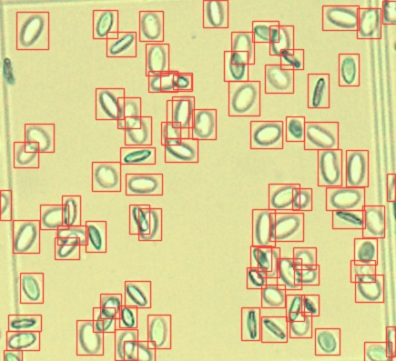

# BAW Fish Cell YOLOv5

Repository for training and setup of fish cell counting with YOLOv5.

## Setup environment

```bash
# Create environment inside project folder
python3 -m venv env
# Activate environment
source env/bin/activate
# Clone Yolo
git clone https://github.com/ultralytics/yolov5
# Install packages
pip install -r yolov5/requirements.txt
# Unzip dataset
unzip content/dataset.zip
```

## LabelImg

<https://github.com/heartexlabs/labelImg>

## Changing source images

If you change the source images please create a new `content/dataset.zip` file, as the dataset folder is not version controlled.

```bash
cd content
zip -r dataset.zip dataset
```

## Important files

Inside [content](content) folder you can find the `fish.yaml` to define folder paths to the dataset and classes. The `current.pt` file are the currently used weights of the best training run. The archive `dataset.zip` contains the training and validation dataset.

The notebook [index.ipynb](index.ipynb) contains all information to run training and testing.

### Training

See [index.ipynb](index.ipynb).

```bash
python yolov5/train.py \
    --weights='yolov5s.pt' \
    --data='content/fish.yaml' \
    --epochs=300 \
    --img-size=640 \
    --name='baw' \
    --device='cpu' \
    --project='content/runs/train'
```

### Testing

```bash
python yolov5/val.py \
    --weights='content/current.pt' \
    --data='content/fish.yaml' \
    --imgsz=640 \
    --name='test' \
    --task='test' \
    --project='content/runs'
```

### Inference

The [inference](inference) folder can be used to use on new images.

```bash
python yolov5/detect.py \
    --weights='content/current.pt' \
    --imgsz=640 \
    --source='inference/input' \
    --name='exp' \
    --save-txt \
    --line-thickness=1 \
    --hide-labels \
    --project='inference/output'
```



## License

[MIT 2022](LICENSE.md)
